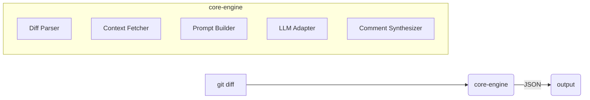

# DiffScope

A composable code review engine for automated diff analysis.

## Features

- **Model Agnostic**: Works with OpenAI, Anthropic Claude 4, Ollama, and any OpenAI-compatible API
- **Git Integration**: Review uncommitted, staged, or branch changes directly
- **PR Reviews**: Analyze and comment on GitHub pull requests
- **Smart Prompting**: Advanced prompt engineering with examples, XML structure, and chain-of-thought
- **Commit Messages**: AI-powered commit message suggestions following conventional commits
- **Composable Architecture**: Modular components that work together
- **Plugin System**: Extensible pre-analyzers and post-processors
- **Multiple Outputs**: JSON, patch, or markdown formats
- **CI/CD Ready**: GitHub Action, GitLab CI, and Docker support
- **Smart Review**: Enhanced analysis with confidence scoring, fix effort estimation, and executive summaries

## Quick Start

### Install via Homebrew (macOS/Linux)
```bash
brew tap haasonsaas/diffscope
brew install diffscope
```

### Install from crates.io
```bash
cargo install diffscope
```

### Docker
```bash
docker run --rm -v $(pwd):/workspace ghcr.io/haasonsaas/diffscope:latest review --diff /workspace/pr.diff
```

## Usage

### Basic Usage
```bash
# Review your current changes
git diff | diffscope review

# Review a specific file diff
diffscope review --diff patch.diff

# Get enhanced analysis with smart review
git diff | diffscope smart-review
```

### Git Integration
```bash
# Review what you're about to commit
diffscope git staged

# Review all uncommitted changes  
diffscope git uncommitted

# Compare your branch to main
diffscope git branch main

# Get AI-powered commit message suggestions
diffscope git suggest
```

### Pull Request Review
```bash
# Review the current PR
diffscope pr

# Review a specific PR number
diffscope pr --number 123

# Post review comments directly to GitHub
diffscope pr --post-comments
```

### Smart Review (Enhanced Analysis)
```bash
# Get professional-grade analysis with confidence scoring
git diff | diffscope smart-review

# Generate executive summary report
diffscope smart-review --diff changes.patch --output report.md

# Review with specific AI model
git diff | diffscope smart-review --model claude-3-5-sonnet-20241022
```

### AI Model Configuration
```bash
# OpenAI (default)
export OPENAI_API_KEY=your-key
git diff | diffscope review --model gpt-4o

# Anthropic Claude
export ANTHROPIC_API_KEY=your-key  
git diff | diffscope review --model claude-3-5-sonnet-20241022

# Local Ollama
git diff | diffscope review --model ollama:codellama
```

### Supported Models

**OpenAI**: gpt-4o, gpt-4-turbo, gpt-3.5-turbo

**Anthropic**: 
- Claude 4: claude-opus-4-20250514, claude-sonnet-4-20250514
- Claude 3.5: claude-3-5-sonnet-20241022, claude-3-5-haiku-20240307
- Claude 3: claude-3-opus-20240229, claude-3-haiku-20240307

**Ollama**: Any locally installed model (codellama, llama3.2, mistral, etc.)

### Output Formats
```bash
# JSON output (default)
git diff | diffscope review --output-format json

# Markdown report  
git diff | diffscope review --output-format markdown > review.md

# Inline patch comments
git diff | diffscope review --output-format patch
```

## GitHub Action

```yaml
name: AI Code Review
on: [pull_request]

jobs:
  review:
    runs-on: ubuntu-latest
    steps:
      - uses: actions/checkout@v4
      - uses: haasonsaas/diffscope@v1
        with:
          model: gpt-4o
          openai-api-key: ${{ secrets.OPENAI_API_KEY }}
          post-comments: true
```

## Configuration

Create a `.diffscope.yml` file in your repository:

```yaml
model: gpt-4o
temperature: 0.2
max_tokens: 4000
system_prompt: "Focus on security vulnerabilities, performance issues, and best practices"
```

## Plugin Development

Create custom analyzers:

```typescript
export interface PreAnalyzer {
  id: string
  run(diff: UnifiedDiff, repoPath: string): Promise<LLMContextChunk[]>
}

export interface PostProcessor {
  id: string
  run(comments: Comment[], repoPath: string): Promise<Comment[]>
}
```

## Architecture



## License

Apache-2.0 License. See [LICENSE](LICENSE) for details.

## Example Output

### Standard Review
```json
[
  {
    "file_path": "src/auth.py",
    "line_number": 42,
    "content": "Potential SQL injection vulnerability",
    "severity": "Error",
    "category": "Security",
    "suggestion": "Use parameterized queries instead of string interpolation"
  }
]
```

### Smart Review Output
```markdown
# 🤖 Smart Review Analysis Results

## 📊 Executive Summary

🟡 **Code Quality Score:** 8.2/10
📝 **Total Issues Found:** 4
🚨 **Critical Issues:** 1
📁 **Files Analyzed:** 3

### 🎯 Priority Actions
1. Address 1 security issue(s) immediately
2. Consider performance optimization for database queries

---

## 🔍 Detailed Analysis

### 🔴 Critical Issues (Fix Immediately)

#### 🔒 **src/auth.py:42** - 🔴 Significant Effort Security
**Confidence:** 95% | **Tags:** `security`, `sql`, `injection`

SQL injection vulnerability detected. User input is directly interpolated into query string without proper sanitization.

**💡 Recommended Fix:**
Use parameterized queries to prevent SQL injection attacks.

**🔧 Code Example:**
```diff
- query = f"SELECT * FROM users WHERE username='{username}'"
+ query = "SELECT * FROM users WHERE username=%s"
+ cursor.execute(query, (username,))
```

### 🟡 High Priority Issues

#### ⚡ **src/models.py:28** - 🟡 Moderate Effort Performance
**Confidence:** 87% | **Tags:** `performance`, `n+1-query`

N+1 query problem detected in user retrieval loop.

**💡 Recommended Fix:**
Use eager loading or bulk queries to reduce database calls.
```

### Commit Message Suggestion
```
feat(auth): add JWT-based authentication system
```

## Author

Jonathan Haas <jonathan@haas.holdings>

## Advanced CI/CD Integration

### Enterprise GitHub Actions Workflow

Here's an example of how large organizations use diffscope in production CI/CD pipelines:

```yaml
name: AI Code Review
on:
  pull_request:
    types: [opened, synchronize]
    branches: [main]

jobs:
  ai-code-review:
    name: AI Code Review with DiffScope
    runs-on: ubuntu-latest
    permissions:
      contents: read
      pull-requests: write

    steps:
      - name: Checkout PR
        uses: actions/checkout@v4
        with:
          fetch-depth: 0
          ref: ${{ github.event.pull_request.head.sha }}

      - name: Install DiffScope with Cache
        uses: actions/cache@v4
        with:
          path: ~/.cargo/bin
          key: ${{ runner.os }}-diffscope-${{ hashFiles('**/Cargo.lock') }}
      
      - run: |
          if ! command -v diffscope &> /dev/null; then
            cargo install diffscope
          fi

      - name: Generate PR Diff
        run: |
          git diff origin/${{ github.event.pull_request.base.ref }}...HEAD > pr.diff

      - name: Run AI Review
        env:
          ANTHROPIC_API_KEY: ${{ secrets.ANTHROPIC_API_KEY }}
        run: |
          diffscope review --model claude-3-5-sonnet-20241022 \
            --diff pr.diff --output-format json > review.json

      - name: Post Review Comments
        uses: actions/github-script@v7
        with:
          script: |
            const fs = require('fs');
            const review = JSON.parse(fs.readFileSync('review.json', 'utf8'));
            
            let body = '## 🤖 AI Code Review\n\n';
            if (review.length === 0) {
              body += '✅ **No issues found!** Code looks good!';
            } else {
              body += review.map((item, i) => 
                `**${i+1}.** \`${item.file_path}:${item.line_number}\`\n` +
                `${item.content}\n` +
                (item.suggestion ? `\n💡 **Suggestion:** ${item.suggestion}\n` : '')
              ).join('\n---\n');
            }
            
            github.rest.issues.createComment({
              issue_number: context.issue.number,
              owner: context.repo.owner,
              repo: context.repo.repo,
              body: body
            });
```

### Enterprise Configuration Example

For a large Python/FastAPI application at a company like Acme Inc:

**.diffscope.yml**
```yaml
# Acme Inc DiffScope Configuration
model: "claude-3-5-sonnet-20241022"
temperature: 0.1  # Low for consistent reviews
max_tokens: 4000

system_prompt: |
  You are reviewing Python code for a production FastAPI application.
  
  Critical focus areas:
  - SQL injection and security vulnerabilities
  - Async/await correctness
  - Resource leaks and memory issues
  - API contract consistency
  - Production deployment concerns
  
  Prioritize by severity: Security > Performance > Maintainability

# File filters for monorepo
include_patterns:
  - "src/**/*.py"
  - "tests/**/*.py"
  - "alembic/versions/*.py"
  - "*.yml"
  - "Dockerfile*"

exclude_patterns:
  - "**/__pycache__/**"
  - "**/venv/**"
  - "**/.pytest_cache/**"
  - "**/node_modules/**"

# Review configuration
max_diff_size: 10000
context_lines: 3
```

### Integration with Other CI Tools

**GitLab CI Example:**
```yaml
code-review:
  stage: review
  image: rust:alpine
  only:
    - merge_requests
  script:
    - apk add --no-cache git
    - cargo install diffscope
    - git diff origin/$CI_MERGE_REQUEST_TARGET_BRANCH_NAME...HEAD > mr.diff
    - diffscope smart-review --diff mr.diff --output review.md
  artifacts:
    reports:
      codequality: review.md
```

**Jenkins Pipeline:**
```groovy
stage('AI Code Review') {
  steps {
    sh '''
      curl -sSL https://sh.rustup.rs | sh -s -- -y
      source $HOME/.cargo/env
      cargo install diffscope
      
      git diff origin/${env.CHANGE_TARGET}...HEAD > pr.diff
      diffscope review --diff pr.diff --output-format json > review.json
    '''
    
    publishHTML([
      allowMissing: false,
      alwaysLinkToLastBuild: true,
      keepAll: true,
      reportDir: '.',
      reportFiles: 'review.json',
      reportName: 'AI Code Review'
    ])
  }
}
```

### Best Practices for CI/CD Integration

1. **Cache Installation**: Cache cargo/diffscope binaries to speed up CI runs
2. **API Key Management**: Use secure secret storage for API keys
3. **Diff Size Limits**: Set max diff size to avoid timeouts on large PRs
4. **Custom Prompts**: Tailor system prompts to your tech stack and standards
5. **Output Parsing**: Handle both empty reviews and JSON parsing errors gracefully
6. **Conditional Runs**: Skip reviews on draft PRs or specific file types

## Contributing

Contributions are welcome! Please open an issue first to discuss what you would like to change.

## Support

- GitHub Issues: [github.com/Haasonsaas/diffscope/issues](https://github.com/Haasonsaas/diffscope/issues)