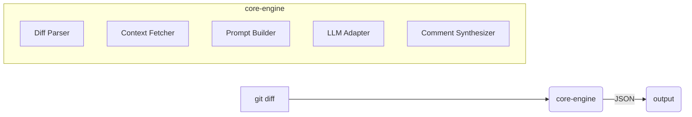

# DiffScope

A composable code review engine for automated diff analysis.

## Features

- **Model Agnostic**: Works with OpenAI, Anthropic Claude 4, Ollama, and any OpenAI-compatible API
- **Git Integration**: Review uncommitted, staged, or branch changes directly
- **PR Reviews**: Analyze and comment on GitHub pull requests
- **Smart Prompting**: Advanced prompt engineering with examples, XML structure, and chain-of-thought
- **Commit Messages**: AI-powered commit message suggestions following conventional commits
- **Composable Architecture**: Modular components that work together
- **Plugin System**: Extensible pre-analyzers and post-processors
- **Multiple Outputs**: JSON, patch, or markdown formats
- **CI/CD Ready**: GitHub Action, GitLab CI, and Docker support

## Quick Start

### Install via Homebrew (macOS/Linux)
```bash
brew tap haasonsaas/diffscope
brew install diffscope
```

### Install from source
```bash
cargo install --git https://github.com/Haasonsaas/diffscope
```

### Docker
```bash
docker run --rm -v $(pwd):/workspace ghcr.io/haasonsaas/diffscope:latest review --diff /workspace/pr.diff
```

## Usage

### Review a diff file
```bash
diffscope review --diff changes.diff
```

### Review from stdin
```bash
git diff | diffscope review
```

### Git integration
```bash
# Review uncommitted changes
diffscope git uncommitted

# Review staged changes
diffscope git staged

# Review changes from a branch
diffscope git branch main

# Suggest commit message for staged changes
diffscope git suggest
```

### Pull Request review
```bash
# Review current PR
diffscope pr

# Review specific PR
diffscope pr --number 123

# Post comments directly to PR
diffscope pr --post-comments
```

### Use different models
```bash
# OpenAI GPT-4
export OPENAI_API_KEY=your-openai-key
diffscope review --model gpt-4o --diff changes.diff

# Anthropic Claude
export ANTHROPIC_API_KEY=your-anthropic-key
diffscope review --model claude-3-5-sonnet-20241022 --diff changes.diff
diffscope review --model claude-3-haiku-20240307 --diff changes.diff

# Local Ollama
diffscope review --model ollama:codellama --diff changes.diff
diffscope review --model ollama:llama3.2 --diff changes.diff
```

### Supported Models

**OpenAI**: gpt-4o, gpt-4-turbo, gpt-3.5-turbo

**Anthropic**: 
- Claude 4: claude-opus-4-20250514, claude-sonnet-4-20250514
- Claude 3.5: claude-3-5-sonnet-20241022, claude-3-5-haiku-20240307
- Claude 3: claude-3-opus-20240229, claude-3-haiku-20240307

**Ollama**: Any locally installed model (codellama, llama3.2, mistral, etc.)

### Output formats
```bash
# JSON (default)
diffscope review --diff changes.diff --output-format json

# Markdown
diffscope review --diff changes.diff --output-format markdown > review.md

# Patch comments
diffscope review --diff changes.diff --output-format patch
```

## GitHub Action

```yaml
name: Code Review
on: [pull_request]

jobs:
  review:
    runs-on: ubuntu-latest
    steps:
      - uses: actions/checkout@v4
      - uses: haasonsaas/diffscope@v1
        with:
          model: gpt-4o
          openai-api-key: ${{ secrets.OPENAI_API_KEY }}
```

## Configuration

Create a `.diffscope.yml` file in your repository:

```yaml
model: gpt-4o
temperature: 0.2
max_tokens: 4000
system_prompt: |
  You are an expert code reviewer. Focus on:
  - Security vulnerabilities
  - Performance issues
  - Best practices
  - Code clarity
```

## Plugin Development

Create custom analyzers:

```typescript
export interface PreAnalyzer {
  id: string
  run(diff: UnifiedDiff, repoPath: string): Promise<LLMContextChunk[]>
}

export interface PostProcessor {
  id: string
  run(comments: Comment[], repoPath: string): Promise<Comment[]>
}
```

## Architecture



## License

Apache-2.0 License. See [LICENSE](LICENSE) for details.

## Example Output

### Code Review
```
Line 32: Security - Logging raw input data may expose sensitive information. 
Risk of data leakage. Remove or sanitize before logging.

Line 14: Bug - TODO indicates missing error handling. Could cause crashes. 
Implement proper error handling.
```

### Commit Message Suggestion
```
feat(auth): add JWT-based authentication system
```

## Author

Jonathan Haas <jonathan@haas.holdings>

## Contributing

Contributions are welcome! Please open an issue first to discuss what you would like to change.

## Support

- GitHub Issues: [github.com/Haasonsaas/diffscope/issues](https://github.com/Haasonsaas/diffscope/issues)