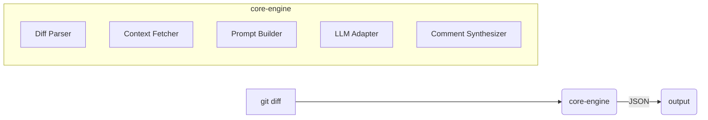
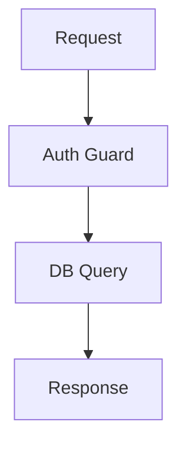

# DiffScope

A composable code review engine for automated diff analysis.

## Features

- **Model Agnostic**: Works with OpenAI, Anthropic Claude, Ollama, and any OpenAI-compatible API
- **Git Integration**: Review uncommitted, staged, or branch changes directly
- **PR Reviews**: Analyze and comment on GitHub pull requests with interactive commands
- **Smart Prompting**: Advanced prompt engineering with examples, XML structure, and chain-of-thought
- **Commit Messages**: AI-powered commit message suggestions following conventional commits
- **Composable Architecture**: Modular components that work together
- **Plugin System**: Extensible pre-analyzers and post-processors
- **Multiple Outputs**: JSON, patch, or markdown formats
- **CI/CD Ready**: GitHub Action, GitLab CI, and Docker support
- **Smart Review**: Enhanced analysis with confidence scoring, fix effort estimation, and executive summaries
- **Path-Based Configuration**: Customize review behavior for different parts of your codebase
- **Changelog Generation**: Generate changelogs and release notes from git history
- **Interactive Commands**: Respond to PR comments with @diffscope commands

## Quick Start

### Install Pre-built Binary (Recommended)

#### Linux/macOS
```bash
curl -sSL https://raw.githubusercontent.com/haasonsaas/diffscope/main/install.sh | sh
```

#### Windows (PowerShell)
```powershell
iwr -useb https://raw.githubusercontent.com/haasonsaas/diffscope/main/install.ps1 | iex
```

#### Manual Download
Download the latest binary for your platform from the [releases page](https://github.com/haasonsaas/diffscope/releases/latest):
- Linux: `diffscope-x86_64-unknown-linux-musl`
- macOS Intel: `diffscope-x86_64-apple-darwin`
- macOS Apple Silicon: `diffscope-aarch64-apple-darwin`
- Windows: `diffscope-x86_64-pc-windows-msvc.exe`

### Install via Package Managers

#### Homebrew (macOS/Linux)
```bash
brew tap haasonsaas/diffscope
brew install diffscope
```

#### Cargo (requires Rust)
```bash
cargo install diffscope
```

### Docker
```bash
# Pull the latest image
docker pull ghcr.io/haasonsaas/diffscope:latest

# Run with current directory mounted
docker run --rm -v $(pwd):/workspace ghcr.io/haasonsaas/diffscope:latest review --diff /workspace/pr.diff

# Create an alias for convenience
alias diffscope='docker run --rm -v $(pwd):/workspace ghcr.io/haasonsaas/diffscope:latest'
```

## Usage

### Basic Usage
```bash
# Review your current changes
git diff | diffscope review

# Review a specific file diff
diffscope review --diff patch.diff

# Run without stdin to review uncommitted changes
diffscope review

# Get enhanced analysis with smart review
git diff | diffscope smart-review
```

### Git Integration
```bash
# Review what you're about to commit
diffscope git staged

# Review all uncommitted changes  
diffscope git uncommitted

# Compare your branch to main
diffscope git branch main

# Compare your branch to the repo default
diffscope git branch

# Get AI-powered commit message suggestions
diffscope git suggest
```

### Pull Request Review
```bash
# Review the current PR
diffscope pr

# Review a specific PR number
diffscope pr --number 123

# Post review comments directly to GitHub
diffscope pr --post-comments
```

### Smart Review (Enhanced Analysis)
```bash
# Get professional-grade analysis with confidence scoring
git diff | diffscope smart-review

# Generate executive summary report
diffscope smart-review --diff changes.patch --output report.md

# Review with specific AI model
git diff | diffscope smart-review --model claude-3-5-sonnet-20241022
```

### AI Model Configuration
```bash
# OpenAI (default)
export OPENAI_API_KEY=your-key
git diff | diffscope review --model gpt-4o

# Force OpenAI Responses API usage
git diff | diffscope review --openai-responses true

# Anthropic Claude
export ANTHROPIC_API_KEY=your-key  
git diff | diffscope review --model claude-3-5-sonnet-20241022

# Local Ollama
git diff | diffscope review --model ollama:codellama

# Custom API endpoint
export OPENAI_BASE_URL=https://api.custom.com/v1
git diff | diffscope review --model custom-model
```

### Supported Models

**OpenAI**: gpt-4o, gpt-4-turbo, gpt-3.5-turbo

**Anthropic**: claude-3-5-sonnet-20241022, claude-3-5-haiku-20240307, claude-3-opus-20240229, claude-3-haiku-20240307, and newer Claude models

**Ollama**: Any locally installed model (codellama, llama3.2, mistral, etc.) - use `ollama:model-name` format

### Output Formats
```bash
# JSON output (default)
git diff | diffscope review --output-format json

# Markdown report  
git diff | diffscope review --output-format markdown > review.md

# Inline patch comments
git diff | diffscope review --output-format patch
```

## GitHub Action

```yaml
name: AI Code Review
on: [pull_request]

jobs:
  review:
    runs-on: ubuntu-latest
    steps:
      - uses: actions/checkout@v4
      - uses: haasonsaas/diffscope@v1
        with:
          model: gpt-4o
          openai-api-key: ${{ secrets.OPENAI_API_KEY }}
          post-comments: true
```

## Configuration

Create a `.diffscope.yml` file in your repository:

```yaml
model: gpt-4o
temperature: 0.2
max_tokens: 4000
max_context_chars: 20000  # 0 disables context truncation
max_diff_chars: 40000     # 0 disables diff truncation
min_confidence: 0.0       # Drop comments below this confidence (0.0-1.0)
review_profile: balanced  # balanced | chill | assertive
review_instructions: |
  Prioritize security and correctness issues. Avoid stylistic comments unless they impact maintainability.
smart_review_summary: true   # Include AI-generated PR summary in smart-review output
smart_review_diagram: false  # Generate a Mermaid diagram in smart-review output
symbol_index: true           # Build repo symbol index for cross-file context (respects .gitignore)
symbol_index_provider: regex # regex | lsp
symbol_index_lsp_command: rust-analyzer
symbol_index_lsp_languages:
  rs: rust
symbol_index_max_files: 500
symbol_index_max_bytes: 200000
symbol_index_max_locations: 5
feedback_path: ".diffscope.feedback.json"
system_prompt: "Focus on security vulnerabilities, performance issues, and best practices"
openai_use_responses: true  # Use OpenAI Responses API (recommended) instead of chat completions

# Built-in plugins (enabled by default)
plugins:
  eslint: true          # JavaScript/TypeScript linting
  semgrep: true         # Security-focused static analysis  
  duplicate_filter: true # Remove duplicate comments

# Global exclusions
exclude_patterns:
  - "**/*.generated.*"
  - "**/node_modules/**"
  - "**/__pycache__/**"
```

Set `symbol_index_provider: lsp` to use a language server; it falls back to regex indexing if the LSP binary is missing. Configure `symbol_index_lsp_languages` and `symbol_index_lsp_command` to match your server (for example, `typescript-language-server --stdio` with `ts`/`tsx` language IDs). If you omit `symbol_index_lsp_command`, diffscope will try to auto-detect a server based on installed binaries and the file types in your repo.

### LSP Symbol Index Examples (All Common Languages)

Pick one LSP server per run (one `symbol_index_lsp_command`). Update the language map to match the server you installed.

```yaml
# Rust (rust-analyzer)
symbol_index_provider: lsp
symbol_index_lsp_command: rust-analyzer
symbol_index_lsp_languages:
  rs: rust

# TypeScript / JavaScript (typescript-language-server)
# symbol_index_provider: lsp
# symbol_index_lsp_command: "typescript-language-server --stdio"
# symbol_index_lsp_languages:
#   ts: typescript
#   tsx: typescriptreact
#   js: javascript
#   jsx: javascriptreact

# Python (python-lsp-server / pylsp)
# symbol_index_provider: lsp
# symbol_index_lsp_command: pylsp
# symbol_index_lsp_languages:
#   py: python
#   pyi: python

# Go (gopls)
# symbol_index_provider: lsp
# symbol_index_lsp_command: gopls
# symbol_index_lsp_languages:
#   go: go

# Java (Eclipse JDT LS)
# symbol_index_provider: lsp
# symbol_index_lsp_command: "jdtls -configuration /path/to/config -data /path/to/workspace"
# symbol_index_lsp_languages:
#   java: java

# Kotlin (Kotlin LSP)
# symbol_index_provider: lsp
# symbol_index_lsp_command: kotlin-lsp
# symbol_index_lsp_languages:
#   kt: kotlin

# C / C++ (clangd)
# symbol_index_provider: lsp
# symbol_index_lsp_command: clangd
# symbol_index_lsp_languages:
#   c: c
#   h: c
#   cpp: cpp
#   hpp: cpp

# C# (csharp-ls)
# symbol_index_provider: lsp
# symbol_index_lsp_command: csharp-ls
# symbol_index_lsp_languages:
#   cs: csharp

# Ruby (solargraph)
# symbol_index_provider: lsp
# symbol_index_lsp_command: "solargraph stdio"
# symbol_index_lsp_languages:
#   rb: ruby

# PHP (Phpactor)
# symbol_index_provider: lsp
# symbol_index_lsp_command: "phpactor language-server"
# symbol_index_lsp_languages:
#   php: php
```

### LSP Setup Notes (Install + Command)

For detailed install commands, OS-specific package manager options, and troubleshooting, see `docs/lsp.md`.

## Plugin Development

Create custom analyzers:

```typescript
export interface PreAnalyzer {
  id: string
  run(diff: UnifiedDiff, repoPath: string): Promise<LLMContextChunk[]>
}

export interface PostProcessor {
  id: string
  run(comments: Comment[], repoPath: string): Promise<Comment[]>
}
```

## Architecture



## License

Apache-2.0 License. See [LICENSE](LICENSE) for details.

## Example Output

### Standard Review
```json
[
  {
    "file_path": "src/auth.py",
    "line_number": 42,
    "content": "Potential SQL injection vulnerability",
    "severity": "Error",
    "category": "Security",
    "suggestion": "Use parameterized queries instead of string interpolation"
  }
]
```

### Smart Review Output
```markdown
# 🤖 Smart Review Analysis Results

## 📊 Executive Summary

🟡 **Code Quality Score:** 8.2/10
📝 **Total Issues Found:** 4
🚨 **Critical Issues:** 1
📁 **Files Analyzed:** 3

## 🧾 PR Summary

**Add auth safeguards** (Fix)

### Key Changes

- Harden auth query handling
- Add route-level guards
- Introduce safe defaults for user lookups

### Diagram



## 🧭 Change Walkthrough

- `src/auth.py` (modified; +12, -3)
- `src/models.py` (modified; +8, -1)
- `src/routes.py` (new; +24, -0)

### 🎯 Priority Actions
1. Address 1 security issue(s) immediately
2. Consider performance optimization for database queries

---

## 🔍 Detailed Analysis

### 🔴 Critical Issues (Fix Immediately)

#### 🔒 **src/auth.py:42** - 🔴 Significant Effort Security
**Confidence:** 95% | **Tags:** `security`, `sql`, `injection`

SQL injection vulnerability detected. User input is directly interpolated into query string without proper sanitization.

**💡 Recommended Fix:**
Use parameterized queries to prevent SQL injection attacks.

**🔧 Code Example:**
```diff
- query = f"SELECT * FROM users WHERE username='{username}'"
+ query = "SELECT * FROM users WHERE username=%s"
+ cursor.execute(query, (username,))
```

### 🟡 High Priority Issues

#### ⚡ **src/models.py:28** - 🟡 Moderate Effort Performance
**Confidence:** 87% | **Tags:** `performance`, `n+1-query`

N+1 query problem detected in user retrieval loop.

**💡 Recommended Fix:**
Use eager loading or bulk queries to reduce database calls.
```

### Commit Message Suggestion
```
feat(auth): add JWT-based authentication system
```

## Author

Jonathan Haas <jonathan@haas.holdings>

## Advanced CI/CD Integration

### Enterprise GitHub Actions Workflow

Here's an example of how large organizations use diffscope in production CI/CD pipelines:

```yaml
name: AI Code Review
on:
  pull_request:
    types: [opened, synchronize]
    branches: [main]

jobs:
  ai-code-review:
    name: AI Code Review with DiffScope
    runs-on: ubuntu-latest
    permissions:
      contents: read
      pull-requests: write

    steps:
      - name: Checkout PR
        uses: actions/checkout@v4
        with:
          fetch-depth: 0
          ref: ${{ github.event.pull_request.head.sha }}

      - name: Install DiffScope with Cache
        uses: actions/cache@v4
        with:
          path: ~/.cargo/bin
          key: ${{ runner.os }}-diffscope-${{ hashFiles('**/Cargo.lock') }}
      
      - run: |
          if ! command -v diffscope &> /dev/null; then
            cargo install diffscope
          fi

      - name: Generate PR Diff
        run: |
          git diff origin/${{ github.event.pull_request.base.ref }}...HEAD > pr.diff

      - name: Run AI Review
        env:
          ANTHROPIC_API_KEY: ${{ secrets.ANTHROPIC_API_KEY }}
        run: |
          diffscope review --model claude-3-5-sonnet-20241022 \
            --diff pr.diff --output-format json > review.json

      - name: Post Review Comments
        uses: actions/github-script@v7
        with:
          script: |
            const fs = require('fs');
            const review = JSON.parse(fs.readFileSync('review.json', 'utf8'));
            
            let body = '## 🤖 AI Code Review\n\n';
            if (review.length === 0) {
              body += '✅ **No issues found!** Code looks good!';
            } else {
              body += review.map((item, i) => 
                `**${i+1}.** \`${item.file_path}:${item.line_number}\`\n` +
                `${item.content}\n` +
                (item.suggestion ? `\n💡 **Suggestion:** ${item.suggestion}\n` : '')
              ).join('\n---\n');
            }
            
            github.rest.issues.createComment({
              issue_number: context.issue.number,
              owner: context.repo.owner,
              repo: context.repo.repo,
              body: body
            });
```

### Enterprise Configuration Example

For a large Python/FastAPI application at a company like Acme Inc:

**.diffscope.yml**
```yaml
# Acme Inc DiffScope Configuration
model: "claude-3-5-sonnet-20241022"
temperature: 0.1  # Low for consistent reviews
max_tokens: 4000
min_confidence: 0.2
review_profile: assertive
smart_review_summary: true
smart_review_diagram: true
symbol_index: true

system_prompt: |
  You are reviewing Python code for a production FastAPI application.
  
  Critical focus areas:
  - SQL injection and security vulnerabilities
  - Async/await correctness
  - Resource leaks and memory issues
  - API contract consistency
  - Production deployment concerns
  
  Prioritize by severity: Security > Performance > Maintainability

# File filters for monorepo
exclude_patterns:
  - "**/__pycache__/**"
  - "**/venv/**"
  - "**/.pytest_cache/**"
  - "**/node_modules/**"
  - "**/*.generated.*"

# Review configuration
max_context_chars: 20000
max_diff_chars: 40000
```

### Integration with Other CI Tools

**GitLab CI Example:**
```yaml
code-review:
  stage: review
  image: rust:alpine
  only:
    - merge_requests
  script:
    - apk add --no-cache git
    - cargo install diffscope
    - git diff origin/$CI_MERGE_REQUEST_TARGET_BRANCH_NAME...HEAD > mr.diff
    - diffscope smart-review --diff mr.diff --output review.md
  artifacts:
    reports:
      codequality: review.md
```

**Jenkins Pipeline:**
```groovy
stage('AI Code Review') {
  steps {
    sh '''
      curl -sSL https://sh.rustup.rs | sh -s -- -y
      source $HOME/.cargo/env
      cargo install diffscope
      
      git diff origin/${env.CHANGE_TARGET}...HEAD > pr.diff
      diffscope review --diff pr.diff --output-format json > review.json
    '''
    
    publishHTML([
      allowMissing: false,
      alwaysLinkToLastBuild: true,
      keepAll: true,
      reportDir: '.',
      reportFiles: 'review.json',
      reportName: 'AI Code Review'
    ])
  }
}
```

### Best Practices for CI/CD Integration

1. **Cache Installation**: Cache cargo/diffscope binaries to speed up CI runs
2. **API Key Management**: Use secure secret storage for API keys
3. **Diff Size Limits**: Set max diff size to avoid timeouts on large PRs
4. **Custom Prompts**: Tailor system prompts to your tech stack and standards
5. **Output Parsing**: Handle both empty reviews and JSON parsing errors gracefully
6. **Conditional Runs**: Skip reviews on draft PRs or specific file types

## Available Commands

### Core Commands
```bash
# Review diffs
diffscope review [--diff file.patch]

# Enhanced analysis with confidence scoring
diffscope smart-review [--diff file.patch]

# Git integration
diffscope git uncommitted    # Review uncommitted changes
diffscope git staged         # Review staged changes
diffscope git branch [base]  # Compare against branch (default: repo default)
diffscope git suggest        # Generate commit messages
diffscope git pr-title       # Generate PR titles

# Pull request operations
diffscope pr [--number N] [--post-comments] [--summary]

# Repository check (uncommitted changes at path)
diffscope check [path]

# File comparison
diffscope compare --old-file old.py --new-file new.py

# Changelog generation
diffscope changelog --from v0.4.0 [--to HEAD] [--release v0.5.0]
```

## New Features in v0.5.3

### 🔄 Changelog Generation

Generate professional changelogs and release notes from your git history:

```bash
# Generate changelog from a specific tag to HEAD
diffscope changelog --from v0.4.0 --to HEAD

# Generate release notes for a new version
diffscope changelog --release v0.5.0 --from v0.4.0

# Output to file
diffscope changelog --from v0.4.0 --output CHANGELOG.md
```

The changelog generator:
- Parses conventional commits automatically
- Groups changes by type (features, fixes, etc.)
- Highlights breaking changes
- Shows contributor statistics
- Generates both changelogs and release notes formats

### 🎯 Path-Based Configuration

Customize review behavior for different parts of your codebase:

**.diffscope.yml**
```yaml
# Global configuration
model: gpt-4o
temperature: 0.2
max_tokens: 4000

# Exclude patterns
exclude_patterns:
  - "**/*.generated.*"
  - "**/node_modules/**"

# Path-specific rules
paths:
  # API endpoints need security focus
  "src/api/**":
    ignore_patterns:
      - "**/*.generated.*"
    extra_context:
      - "src/auth/**"
    review_instructions: |
      Prioritize auth, validation, and sensitive data handling.
    system_prompt: |
      Focus on SQL injection, auth bypass, and input validation
    severity_overrides:
      security: error  # All security issues become errors

  # Test files have different standards  
  "tests/**":
    ignore_patterns:
      - "**/*.snap"
    extra_context:
      - "src/main/**"
    severity_overrides:
      style: suggestion  # Style issues are just suggestions

  # Database migrations are critical
  "migrations/**":
    severity_overrides:
      bug: error  # Any bug in migrations is critical
```

### 💬 Interactive PR Commands

*Note: Interactive commands are currently in development.*

Planned support for responding to pull request comments with interactive commands:

```
@diffscope review                 # Re-review the changes
@diffscope review security        # Focus review on security
@diffscope ignore src/generated/  # Ignore specific paths
@diffscope explain line 42        # Explain specific code
@diffscope generate tests         # Generate unit tests
@diffscope help                   # Show all commands
```

### ✅ Feedback Loop (Reduce Repeated False Positives)

Use the feedback store to suppress comments you’ve already reviewed:

```bash
# Reject comments from a prior JSON review output
diffscope feedback --reject review.json

# Accept comments (keeps a record, and removes them from suppress list)
diffscope feedback --accept review.json
```

The feedback file defaults to `.diffscope.feedback.json` and can be configured in `.diffscope.yml`.

**CI helper (GitHub Actions):**

```yaml
- name: Update DiffScope feedback
  if: always()
  run: |
    bash scripts/update_feedback_from_review.sh \
      --action reject \
      --input review.json \
      --feedback .diffscope.feedback.json
```

### 📊 PR Summary Generation

Generate executive summaries for pull requests:

```bash
# Generate PR summary with statistics
diffscope pr --summary

# Generate and post to GitHub
diffscope pr --number 123 --summary --post-comments
```

The summary includes:
- Change statistics and impact analysis
- Key modifications by category
- Risk assessment
- Review recommendations

## Contributing

Contributions are welcome! Please open an issue first to discuss what you would like to change.

## Supported Platforms

DiffScope provides pre-built binaries for the following platforms:

| Platform | Architecture | Binary |
|----------|-------------|---------|
| Linux | x86_64 | `diffscope-x86_64-unknown-linux-musl` (static, works on all distros) |
| Linux | x86_64 | `diffscope-x86_64-unknown-linux-gnu` |
| Linux | ARM64 | `diffscope-aarch64-unknown-linux-gnu` |
| macOS | Intel (x86_64) | `diffscope-x86_64-apple-darwin` |
| macOS | Apple Silicon (ARM64) | `diffscope-aarch64-apple-darwin` |
| Windows | x86_64 | `diffscope-x86_64-pc-windows-msvc.exe` |

All binaries are automatically built and uploaded with each release.

## Support

- GitHub Issues: [github.com/Haasonsaas/diffscope/issues](https://github.com/Haasonsaas/diffscope/issues)
